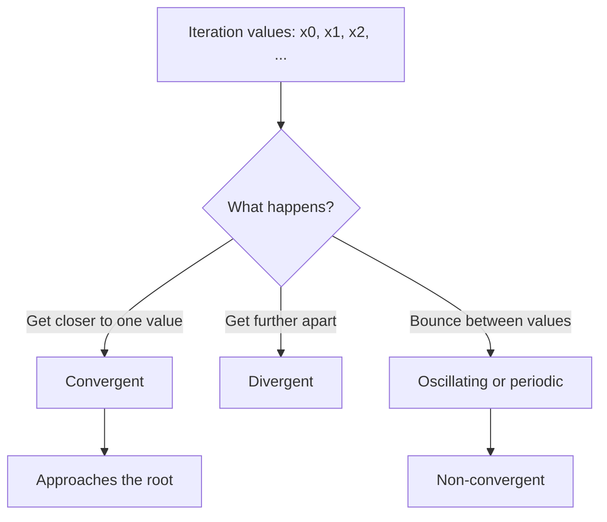

# A21NumericalMethodsMermaid-006_convergence_types

**Asset ID:** A21NumericalMethodsMermaid-006  
**Source:** CCEA specification map + Chapter 10 Numerical Methods evidence  
**Related lesson section:** A21 Numerical Methods lesson  
**Purpose:** Convergence types.

