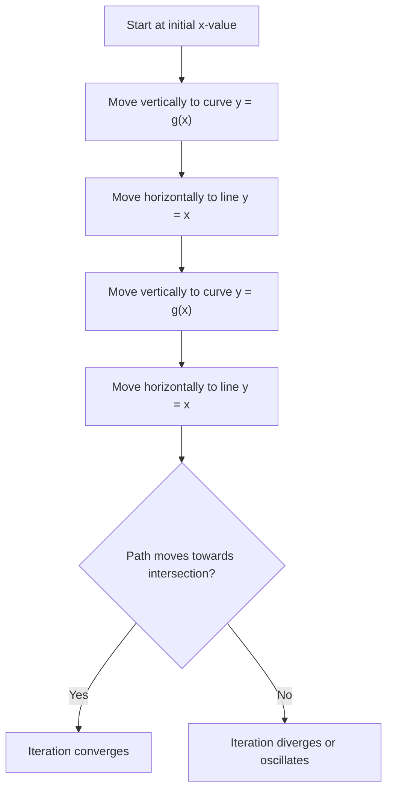

# A21NumericalMethodsMermaid-007_staircase_cobweb_process

**Asset ID:** A21NumericalMethodsMermaid-007  
**Source:** CCEA specification map + Chapter 10 Numerical Methods evidence  
**Related lesson section:** A21 Numerical Methods lesson  
**Purpose:** Staircase/cobweb process.

