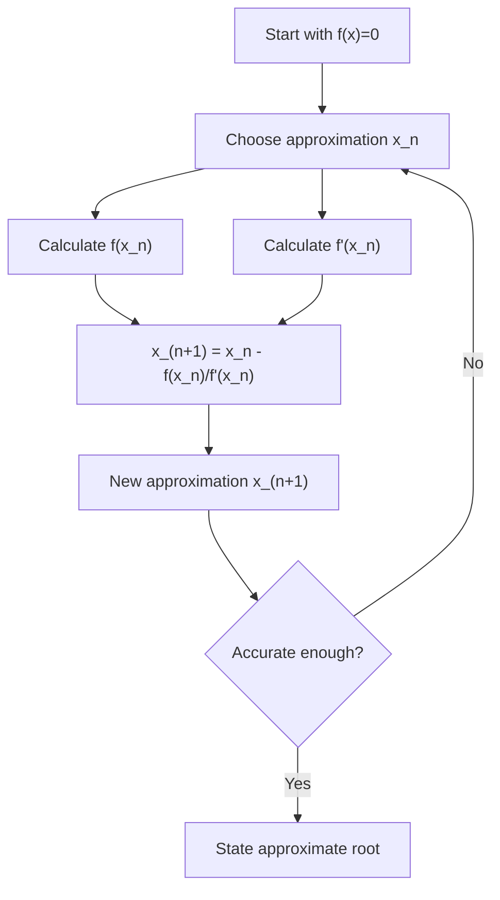

# A21NumericalMethodsMermaid-008_newton_raphson_workflow

**Asset ID:** A21NumericalMethodsMermaid-008  
**Source:** CCEA specification map + Chapter 10 Numerical Methods evidence  
**Related lesson section:** A21 Numerical Methods lesson  
**Purpose:** Newton-Raphson workflow.

