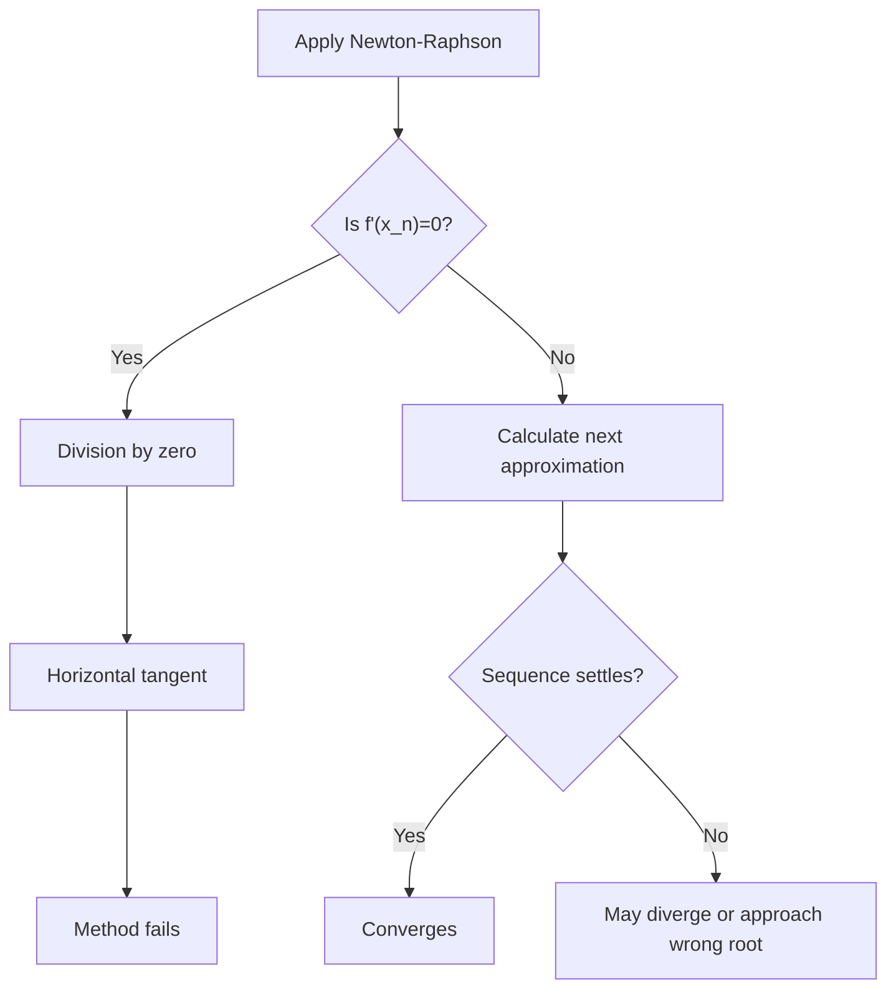

# A21NumericalMethodsMermaid-009_newton_raphson_failure_cases

**Asset ID:** A21NumericalMethodsMermaid-009  
**Source:** CCEA specification map + Chapter 10 Numerical Methods evidence  
**Related lesson section:** A21 Numerical Methods lesson  
**Purpose:** Newton-Raphson failure cases.

