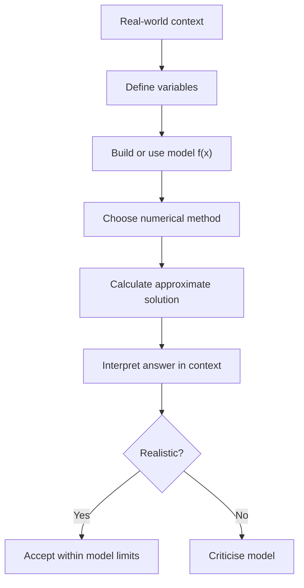

# A21NumericalMethodsMermaid-010_context_modelling_cycle

**Asset ID:** A21NumericalMethodsMermaid-010  
**Source:** CCEA specification map + Chapter 10 Numerical Methods evidence  
**Related lesson section:** A21 Numerical Methods lesson  
**Purpose:** Context modelling cycle.

