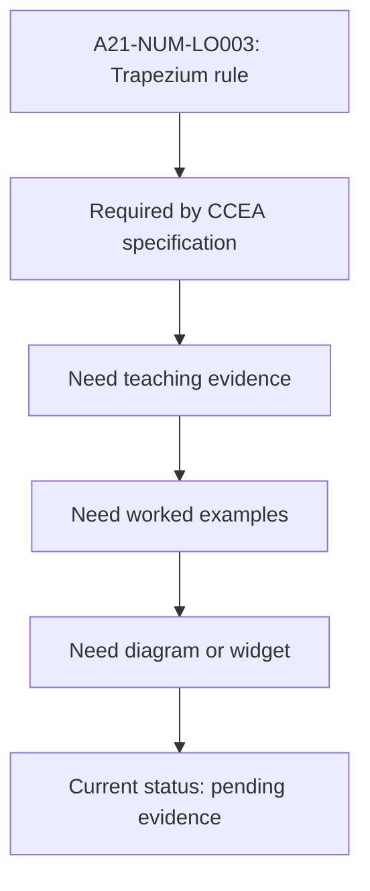

# A21NumericalMethodsMermaid-011_trapezium_rule_gap_placeholder

**Asset ID:** A21NumericalMethodsMermaid-011  
**Source:** CCEA specification map + Chapter 10 Numerical Methods evidence  
**Related lesson section:** A21 Numerical Methods lesson  
**Purpose:** Trapezium rule gap placeholder.

