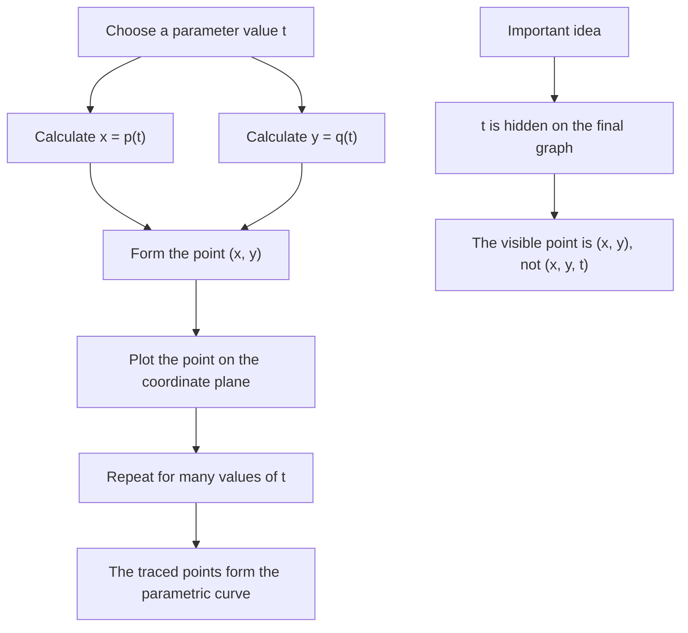

# A21ParametricEquationsMermaid-001

## Asset ID
A21ParametricEquationsMermaid-001

## Source
CCEA specification map A21-CG-LO001; Chapter 8 Parametric Equations transcript and introductory slide evidence.

## Related lesson section
Big Picture Explanation; Key Definitions and Notation.

## Purpose
Show how a parameter generates both coordinates of a point on a curve.

