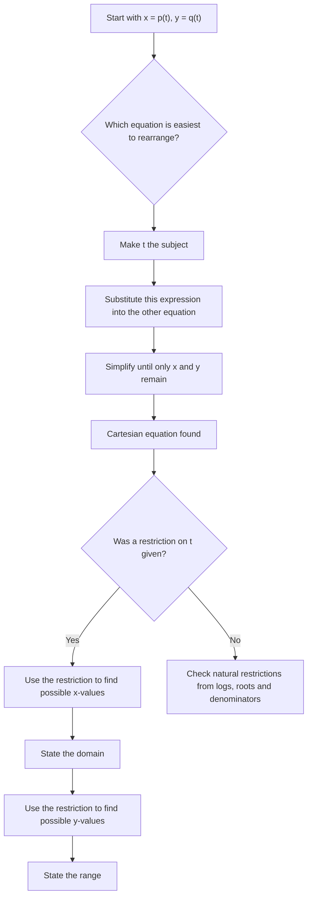

# A21ParametricEquationsMermaid-002

## Asset ID
A21ParametricEquationsMermaid-002

## Source
CCEA specification map A21-CG-LO001; transcript explanation of eliminating \(t\) from \(x=2t,\ y=t^2\).

## Related lesson section
Core Theory; Worked Example 1.

## Purpose
Give students a clean conversion workflow for algebraic parametric equations.

