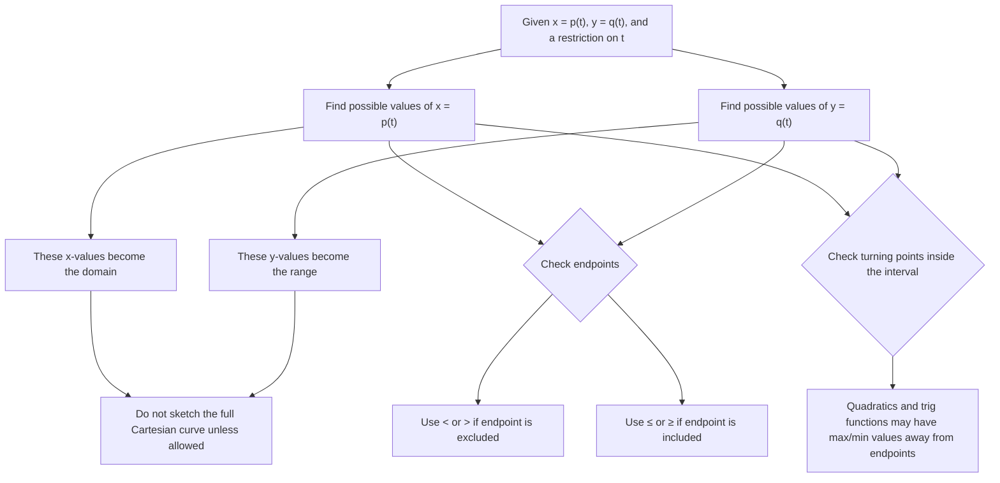

# A21ParametricEquationsMermaid-003

## Asset ID
A21ParametricEquationsMermaid-003

## Source
CCEA specification map A21-CG-LO001; transcript explanation of domain and range transfer.

## Related lesson section
Core Theory; Common Mistakes and Exam Traps.

## Purpose
Prevent the common error of finding the Cartesian equation but forgetting the restricted domain and range.

