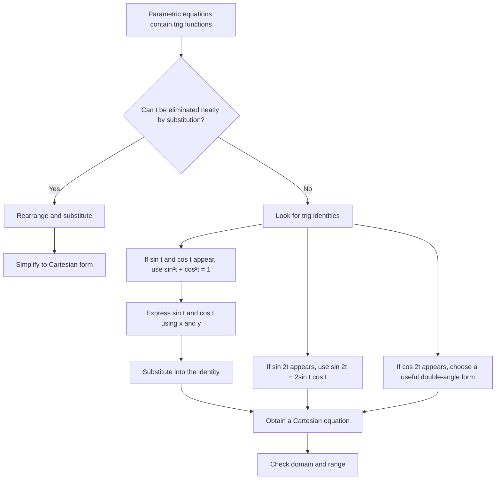

# A21ParametricEquationsMermaid-004

## Asset ID
A21ParametricEquationsMermaid-004

## Source
CCEA specification map A21-CG-LO001; transcript section on trig identity conversion.

## Related lesson section
Core Theory; Worked Examples 3, 4 and 5.

## Purpose
Show when to use trig identities rather than inverse trig rearrangement.

