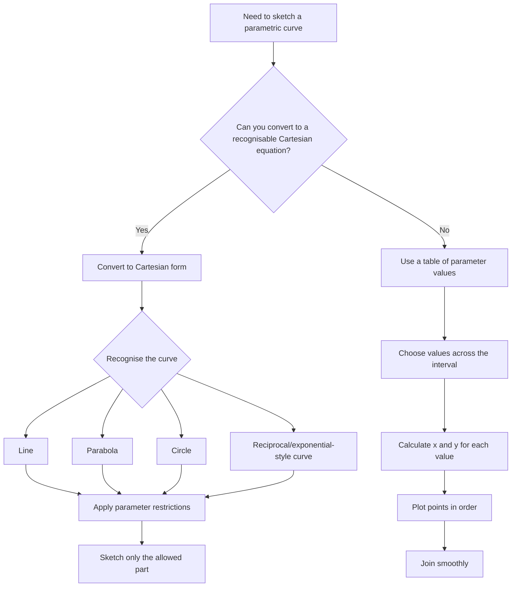

# A21ParametricEquationsMermaid-005

## Asset ID
A21ParametricEquationsMermaid-005

## Source
CCEA specification map A21-CG-LO001; PowerPoint chapter overview on sketching parametric curves.

## Related lesson section
Core Theory; Visual Asset Integration; Exam Technique Notes.

## Purpose
Give students a route-choice diagram for sketching parametric curves.

