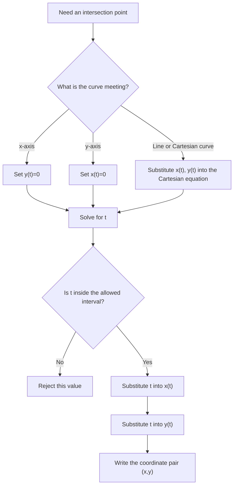

# A21ParametricEquationsMermaid-006

## Asset ID
A21ParametricEquationsMermaid-006

## Source
CCEA specification map A21-CG-LO001; transcript and slide evidence on intersections.

## Related lesson section
Worked Examples 6; Exam Technique Notes.

## Purpose
Show that intersections are usually found by solving for the parameter first, then substituting back.

