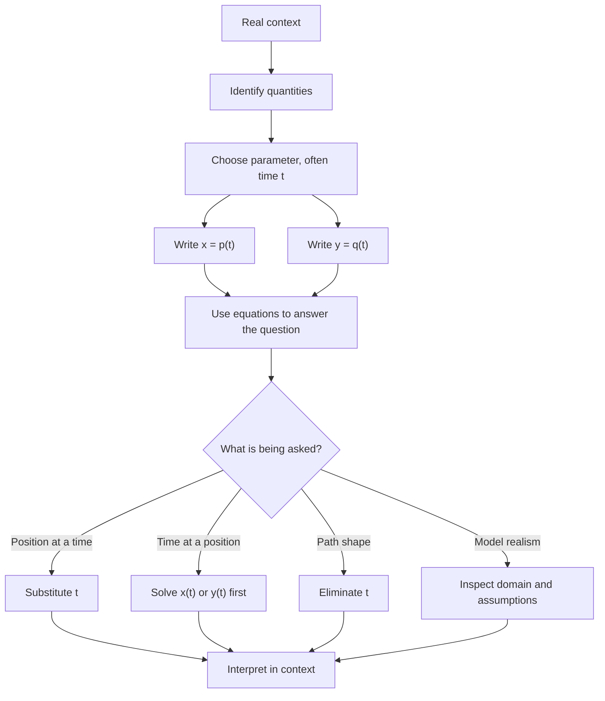

# A21ParametricEquationsMermaid-007

## Asset ID
A21ParametricEquationsMermaid-007

## Source
CCEA specification map A21-CG-LO002; transcript and slide modelling examples.

## Related lesson section
Worked Example 7; Syllabus Gap Check.

## Purpose
Show the modelling cycle for parametric equations in contexts such as plane motion.

