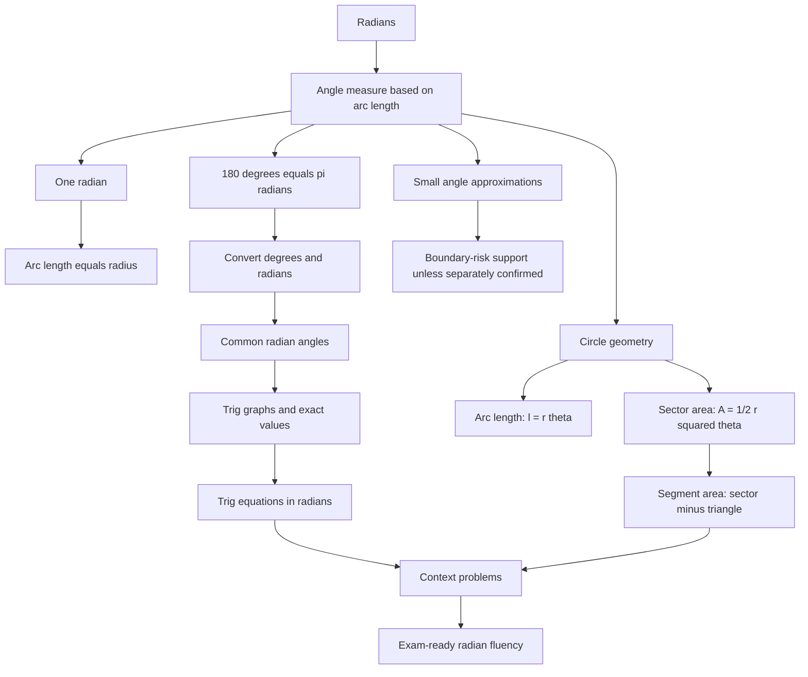

# A21RadiansMermaid-001

## Asset metadata

- Asset ID: A21RadiansMermaid-001
- Unit code: A21
- Topic code: A21-TRIG
- Topic ID: A21Radians
- Source: CCEA specification map, Chapter 5 Radians transcript, P2 Chapter 5 Radians slide PDF
- Related lesson section: Big Picture Explanation
- Purpose: Show the overall lesson route from the meaning of radians to conversions, geometry, trig equations and small angle approximations.
- Phase: Phase 2 Mermaid

