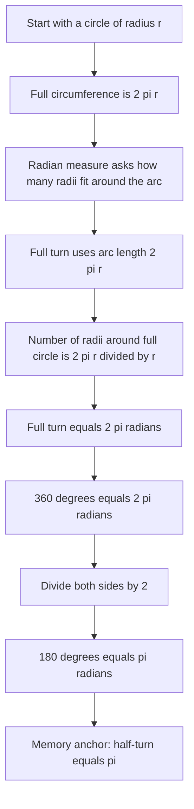

# A21RadiansMermaid-002

## Asset metadata

- Asset ID: A21RadiansMermaid-002
- Unit code: A21
- Topic code: A21-TRIG
- Topic ID: A21Radians
- Source: Chapter 5 Radians transcript and P2 Chapter 5 Radians slide PDF
- Related lesson section: Key Definitions and Notation, Core Theory 8.1
- Purpose: Explain why a full turn is 2 pi radians and why a half-turn is pi radians.
- Phase: Phase 2 Mermaid

