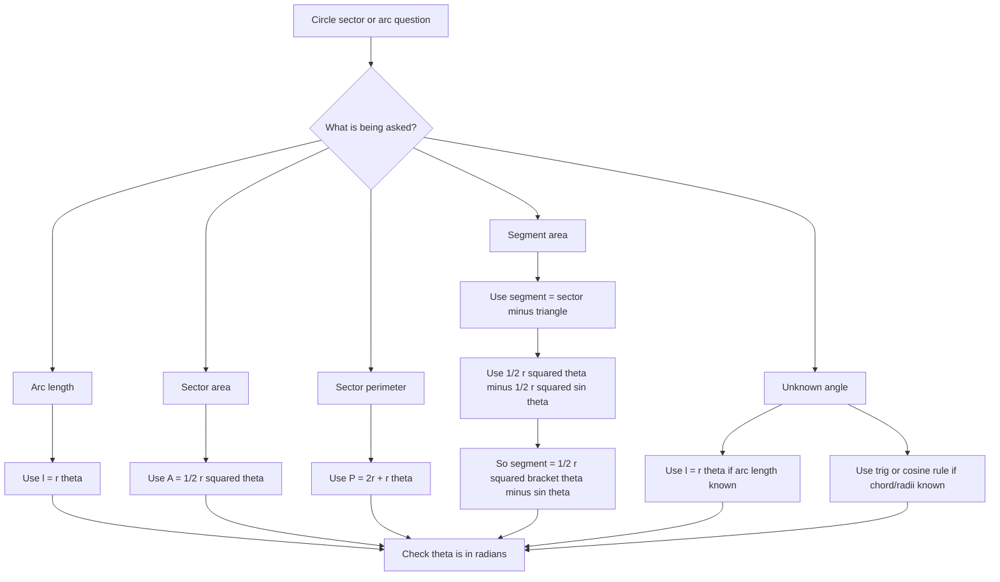

# A21RadiansMermaid-004

## Asset metadata

- Asset ID: A21RadiansMermaid-004
- Unit code: A21
- Topic code: A21-TRIG
- Topic ID: A21Radians
- Source: CCEA A21-TRIG-LO001, Chapter 5 Radians transcript and P2 Chapter 5 Radians slide PDF
- Related lesson section: Core Theory 8.5 to 8.7, Worked Examples 4 to 10
- Purpose: Help students choose the correct radian geometry formula.
- Phase: Phase 2 Mermaid

