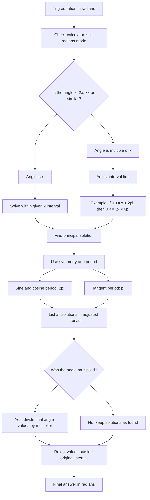

# A21RadiansMermaid-005

## Asset metadata

- Asset ID: A21RadiansMermaid-005
- Unit code: A21
- Topic code: A21-TRIG
- Topic ID: A21Radians
- Source: Chapter 5 Radians transcript and P2 Chapter 5 Radians slide PDF
- Related lesson section: Core Theory 8.8, Worked Examples 11 and 12
- Purpose: Show the safe workflow for solving trig equations in radians.
- Phase: Phase 2 Mermaid

