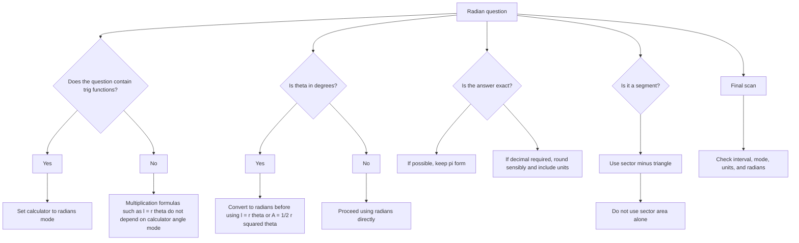

# A21RadiansMermaid-006

## Asset metadata

- Asset ID: A21RadiansMermaid-006
- Unit code: A21
- Topic code: A21-TRIG
- Topic ID: A21Radians
- Source: Chapter 5 Radians transcript and P2 Chapter 5 Radians slide PDF
- Related lesson section: Common Mistakes and Exam Traps, Exam Technique
- Purpose: Show the main calculator and unit traps in radian questions.
- Phase: Phase 2 Mermaid

