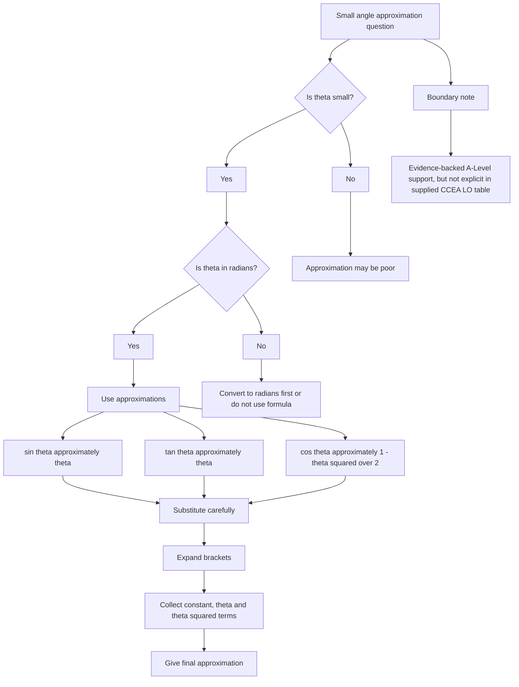

# A21RadiansMermaid-007

## Asset metadata

- Asset ID: A21RadiansMermaid-007
- Unit code: A21
- Topic code: A21-TRIG
- Topic ID: A21Radians
- Source: Chapter 5 Radians transcript and P2 Chapter 5 Radians slide PDF
- Related lesson section: Core Theory 8.9, Boundary-Risk Log
- Purpose: Show how small angle approximation questions are handled while preserving the CCEA boundary warning.
- Phase: Phase 2 Mermaid

