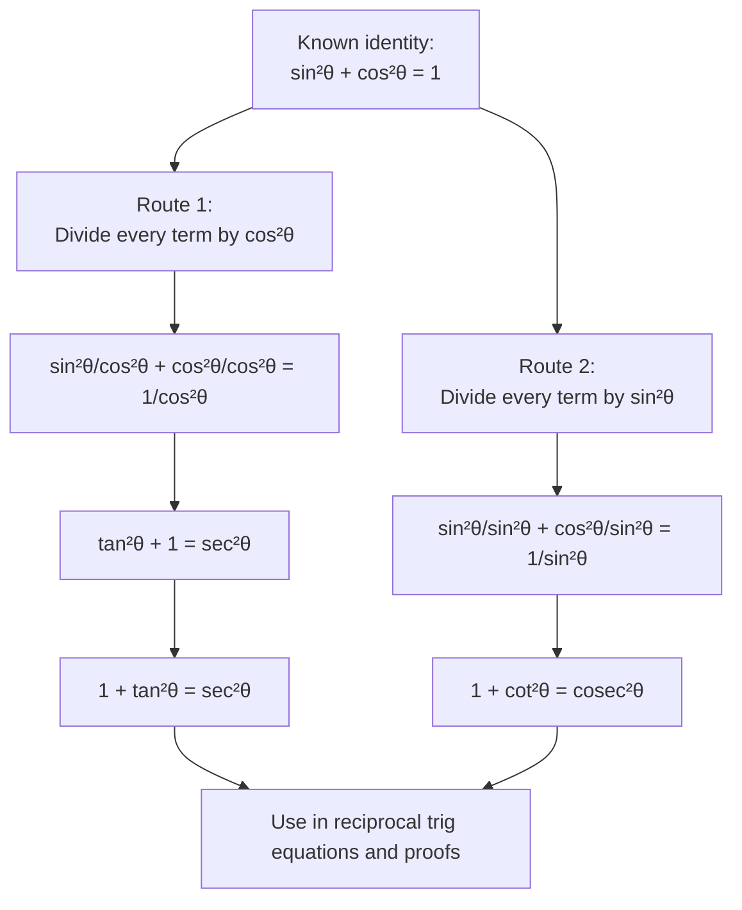

# A21TrigonometricFunctionsMermaid-001

**Asset ID:** `A21TrigonometricFunctionsMermaid-001`  
**Source:** CCEA A21-TRIG-LO004; Chapter 6 lesson evidence on deriving reciprocal identities  
**Related lesson section:** Core Theory → New reciprocal Pythagorean identities  
**Purpose:** Show how both new reciprocal identities are derived from $\sin^2\theta+\cos^2\theta=1$.

