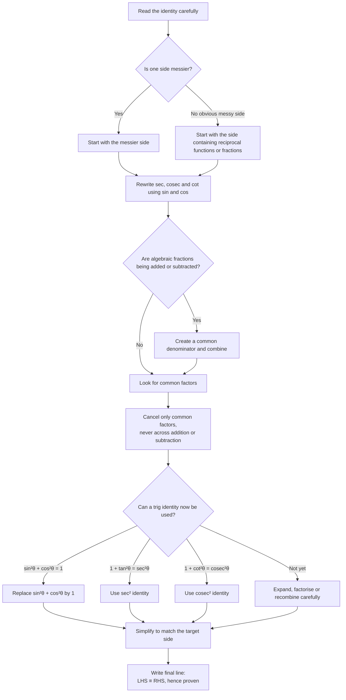

# A21TrigonometricFunctionsMermaid-002

**Asset ID:** `A21TrigonometricFunctionsMermaid-002`  
**Source:** CCEA A21-TRIG-LO008; Chapter 6 proof-method evidence  
**Related lesson section:** Core Theory → Two proof tips for reciprocal trig identities  
**Purpose:** Give students a decision-flow for proving identities involving `sec`, `cosec` and `cot`.

