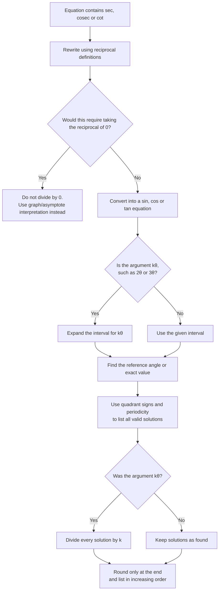

# A21TrigonometricFunctionsMermaid-003

**Asset ID:** `A21TrigonometricFunctionsMermaid-003`  
**Source:** Chapter 6 solving examples involving reciprocal trig equations  
**Related lesson section:** Worked Examples → Solving reciprocal trig equations  
**Purpose:** Show the standard solving route for equations involving `sec`, `cosec` and `cot`.

