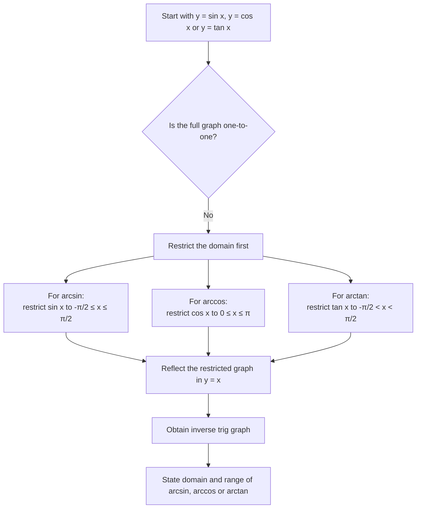

# A21TrigonometricFunctionsMermaid-004

**Asset ID:** `A21TrigonometricFunctionsMermaid-004`  
**Source:** CCEA A21-TRIG-LO002 and A21-TRIG-LO003; Chapter 6 inverse trig evidence  
**Related lesson section:** Inverse Trig Functions  
**Purpose:** Explain why inverse trig functions need restricted domains before reflecting in $y=x$.

