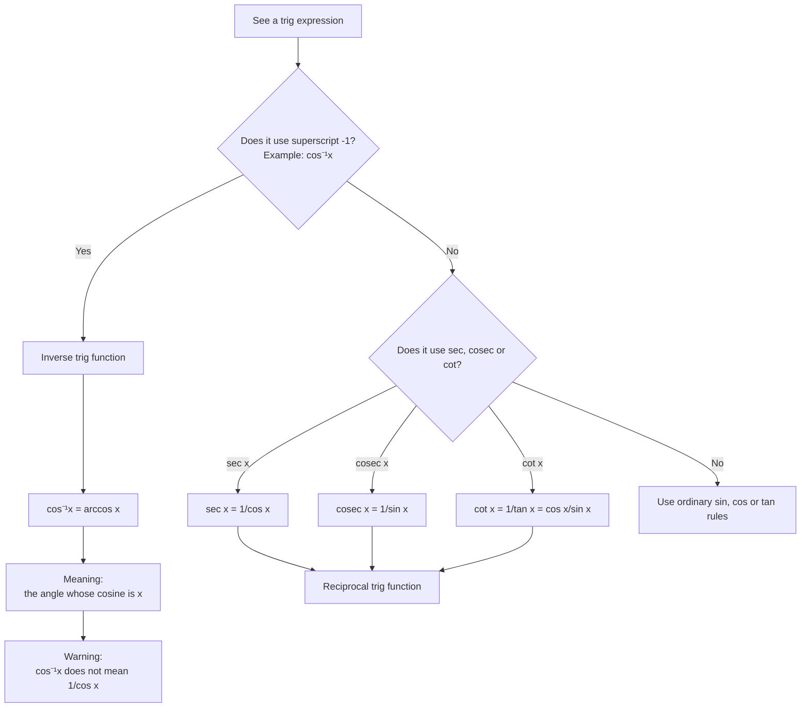

# A21TrigonometricFunctionsMermaid-005

**Asset ID:** `A21TrigonometricFunctionsMermaid-005`  
**Source:** Chapter 6 notation warnings; CCEA A21-TRIG-LO002  
**Related lesson section:** Key Definitions and Notation  
**Purpose:** Prevent the notation trap: confusing inverse trig notation with reciprocal trig notation.

