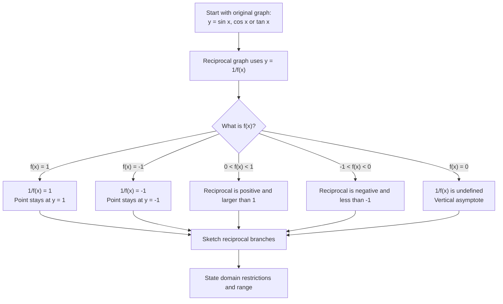

# A21TrigonometricFunctionsMermaid-006

**Asset ID:** `A21TrigonometricFunctionsMermaid-006`  
**Source:** Chapter 6 reciprocal graph explanation; CCEA A21-TRIG-LO003  
**Related lesson section:** Core Theory → Graphs of reciprocal trig functions  
**Purpose:** Show how zeros, small values and $\pm1$ values of the original trig graph control the reciprocal graph.

