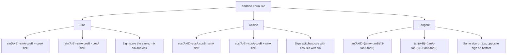

# mermaid/A21TrigonometryAndModellingMermaid-001.md

## Asset ID
A21TrigonometryAndModellingMermaid-001

## Source
CCEA A21-TRIG specification alignment; Chapter 7 Trigonometry & Modelling transcript; P2 Chapter 7 slide PDF.

## Related lesson section
Core Theory Part A

## Purpose
Show how the six addition formulae are organised.

