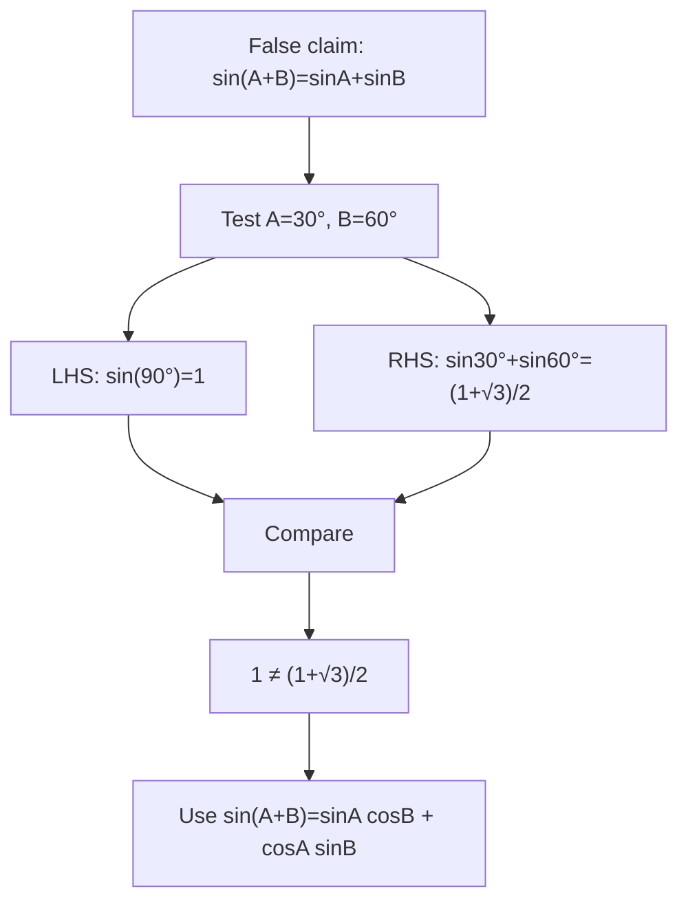

# mermaid/A21TrigonometryAndModellingMermaid-002.md

## Asset ID
A21TrigonometryAndModellingMermaid-002

## Source
CCEA A21-TRIG specification alignment; Chapter 7 Trigonometry & Modelling transcript; P2 Chapter 7 slide PDF.

## Related lesson section
Core Theory Part B

## Purpose
Show why sin(A+B) is not sinA+sinB.

