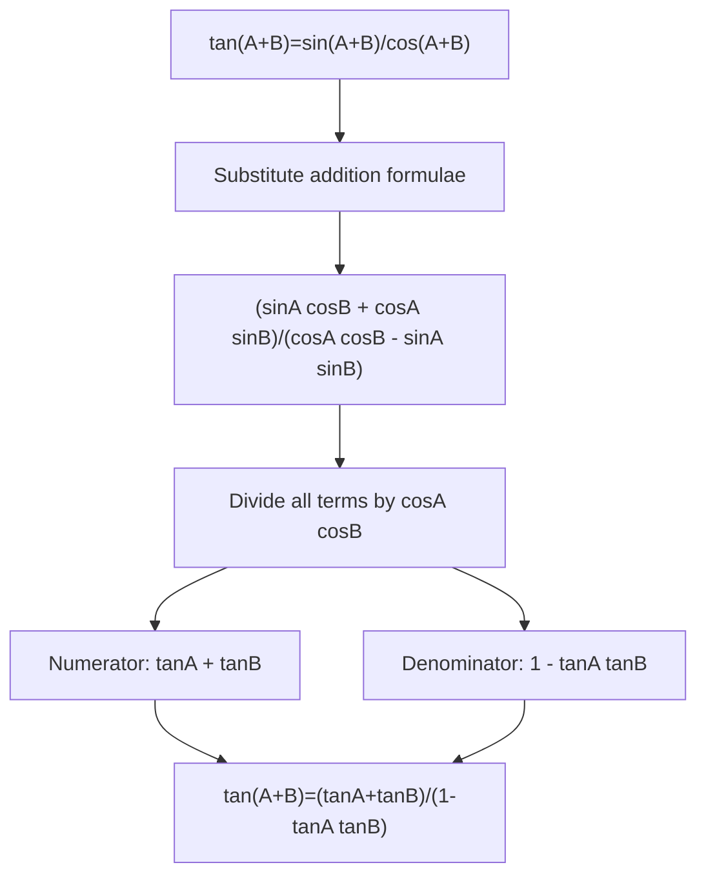

# mermaid/A21TrigonometryAndModellingMermaid-003.md

## Asset ID
A21TrigonometryAndModellingMermaid-003

## Source
CCEA A21-TRIG specification alignment; Chapter 7 Trigonometry & Modelling transcript; P2 Chapter 7 slide PDF.

## Related lesson section
Worked Example 7

## Purpose
Map tangent addition formula proof.

