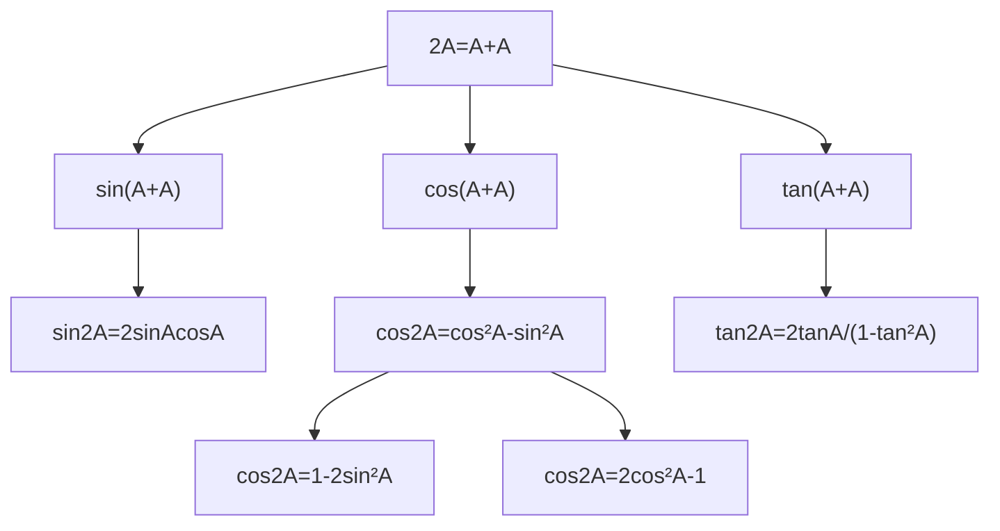

# mermaid/A21TrigonometryAndModellingMermaid-004.md

## Asset ID
A21TrigonometryAndModellingMermaid-004

## Source
CCEA A21-TRIG specification alignment; Chapter 7 Trigonometry & Modelling transcript; P2 Chapter 7 slide PDF.

## Related lesson section
Core Theory Part F

## Purpose
Show formulae from B=A.

