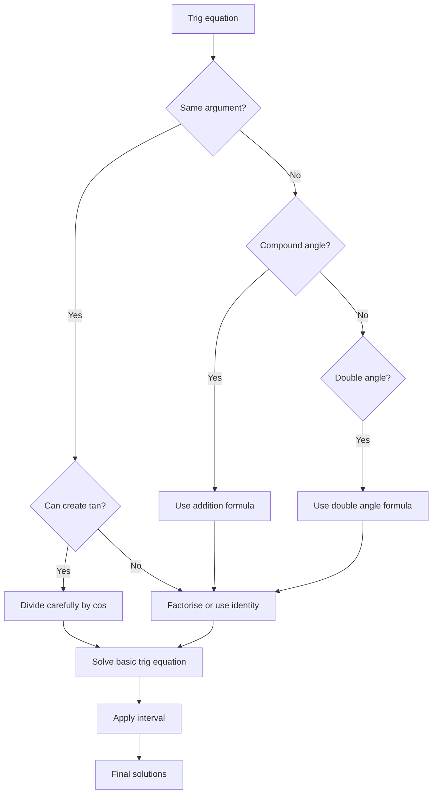

# mermaid/A21TrigonometryAndModellingMermaid-005.md

## Asset ID
A21TrigonometryAndModellingMermaid-005

## Source
CCEA A21-TRIG specification alignment; Chapter 7 Trigonometry & Modelling transcript; P2 Chapter 7 slide PDF.

## Related lesson section
Core Theory Parts G-H

## Purpose
Decision process for trig equations.

