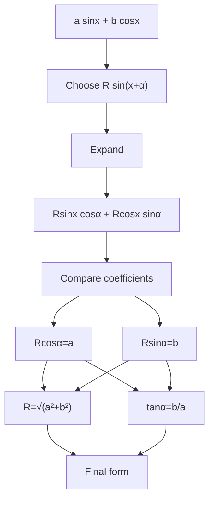

# mermaid/A21TrigonometryAndModellingMermaid-006.md

## Asset ID
A21TrigonometryAndModellingMermaid-006

## Source
CCEA A21-TRIG specification alignment; Chapter 7 Trigonometry & Modelling transcript; P2 Chapter 7 slide PDF.

## Related lesson section
Core Theory Part I

## Purpose
Workflow for harmonic identity.

