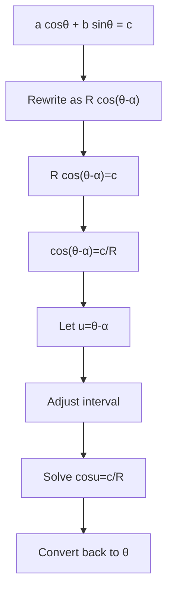

# mermaid/A21TrigonometryAndModellingMermaid-007.md

## Asset ID
A21TrigonometryAndModellingMermaid-007

## Source
CCEA A21-TRIG specification alignment; Chapter 7 Trigonometry & Modelling transcript; P2 Chapter 7 slide PDF.

## Related lesson section
Core Theory Part J

## Purpose
Solve equations after harmonic form.

