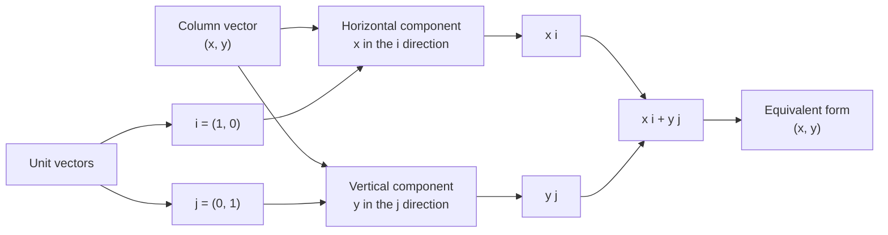

# AS1VectorsMermaid-001

## Asset Metadata

| Field | Value |
|---|---|
| Asset ID | AS1VectorsMermaid-001 |
| Asset type | Mermaid diagram |
| Suggested file | mermaid/AS1VectorsMermaid-001_vector_components.md |
| Source | CCEA AS1-VEC-LO001, AS1-VEC-LO002; Phase 1 lesson Core Theory |
| Related lesson section | Key Definitions and Notation; Core Theory 1 and 2 |
| Purpose | Show how a 2D vector is built from horizontal and vertical components using \(\mathbf{i}\) and \(\mathbf{j}\). |
| Boundary note | 2D vectors only. No \(\mathbf{k}\) notation or 3D vector components. |

## Mermaid Code

