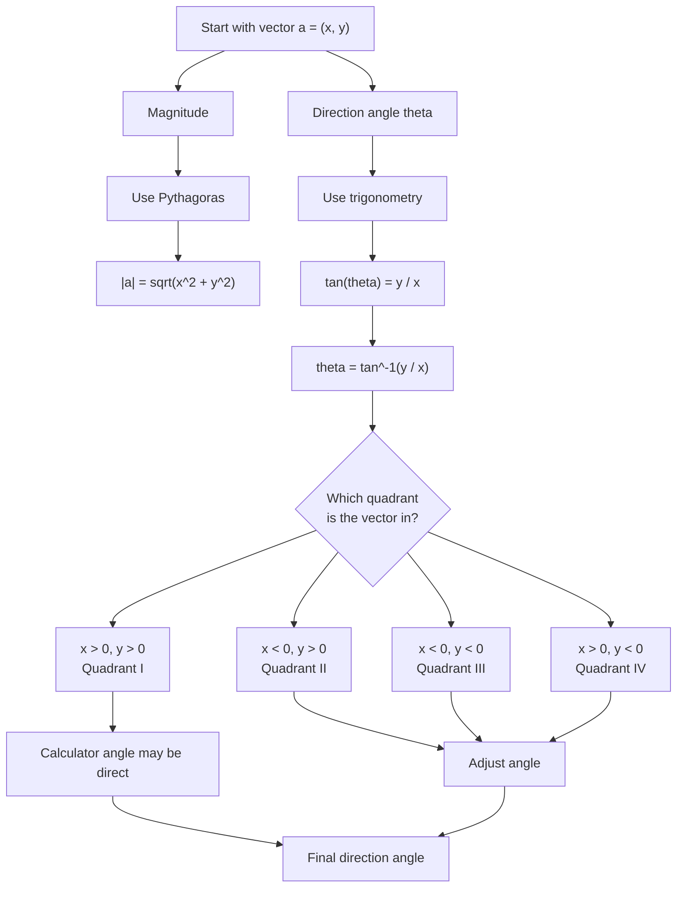

# AS1VectorsMermaid-002

## Asset Metadata

| Field | Value |
|---|---|
| Asset ID | AS1VectorsMermaid-002 |
| Asset type | Mermaid diagram |
| Suggested file | mermaid/AS1VectorsMermaid-002_magnitude_direction.md |
| Source | CCEA AS1-VEC-LO002; Phase 1 Core Theory 2 and 3 |
| Related lesson section | Core Theory: Magnitude of a two-dimensional vector; Direction of a vector |
| Purpose | Show the calculation route from vector components to magnitude and direction. |
| Boundary note | Direction is for a 2D vector measured from the positive \(x\)-axis. Quadrant checking is included. |

## Mermaid Code

