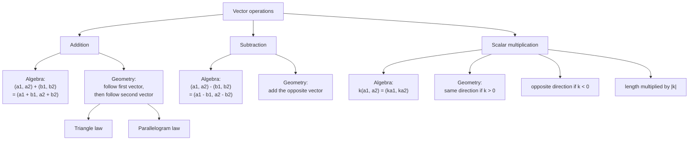

# AS1VectorsMermaid-003

## Asset Metadata

| Field | Value |
|---|---|
| Asset ID | AS1VectorsMermaid-003 |
| Asset type | Mermaid diagram |
| Suggested file | mermaid/AS1VectorsMermaid-003_vector_operations.md |
| Source | CCEA AS1-VEC-LO003; Phase 1 Core Theory 5 |
| Related lesson section | Core Theory: Vector addition, subtraction and scalar multiplication |
| Purpose | Summarise the algebraic and geometric meaning of vector operations. |
| Boundary note | Uses two-dimensional column vectors only. |

## Mermaid Code

