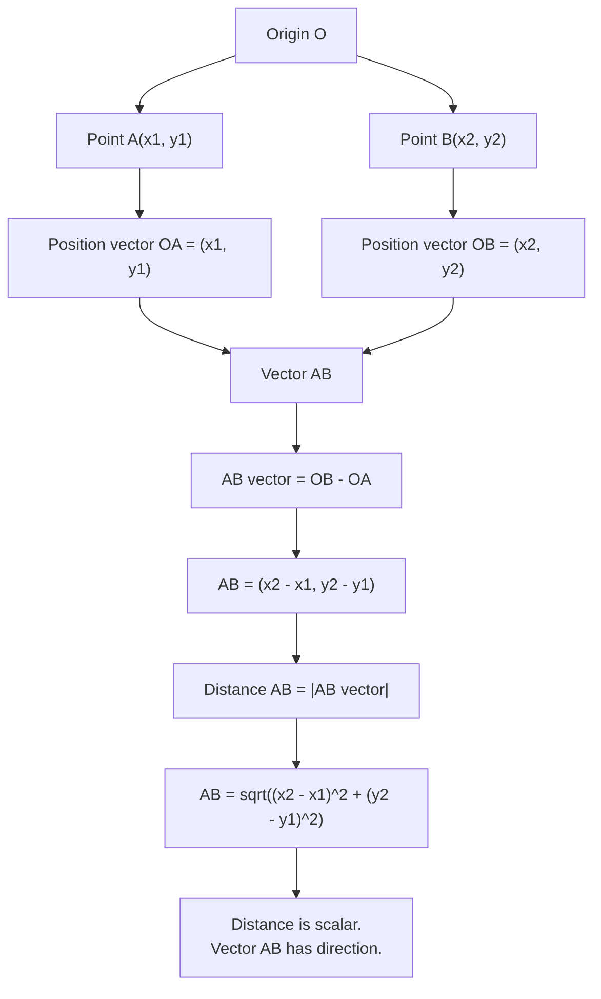

# AS1VectorsMermaid-004

## Asset Metadata

| Field | Value |
|---|---|
| Asset ID | AS1VectorsMermaid-004 |
| Asset type | Mermaid diagram |
| Suggested file | mermaid/AS1VectorsMermaid-004_position_vectors.md |
| Source | CCEA AS1-VEC-LO004, AS1-VEC-LO005; Phase 1 Core Theory 6 and 7 |
| Related lesson section | Core Theory: Position vectors and vectors between points; Distance between two points |
| Purpose | Show the route from position vectors to \(\overrightarrow{AB}\) and then to distance \(AB\). |
| Boundary note | 2D position vectors only. |

## Mermaid Code

