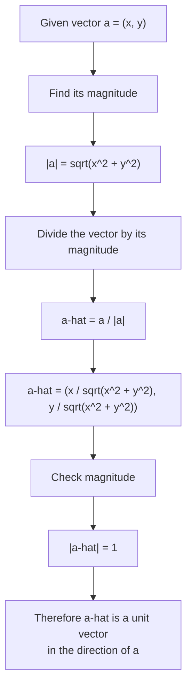

# AS1VectorsMermaid-005

## Asset Metadata

| Field | Value |
|---|---|
| Asset ID | AS1VectorsMermaid-005 |
| Asset type | Mermaid diagram |
| Suggested file | mermaid/AS1VectorsMermaid-005_unit_vector.md |
| Source | CCEA AS1-VEC-LO002; Phase 1 Core Theory 4 |
| Related lesson section | Core Theory: Unit vectors; Worked Example 4 |
| Purpose | Show the step-by-step process for finding a unit vector in the direction of a given vector. |
| Boundary note | 2D unit vectors only. |

## Mermaid Code

