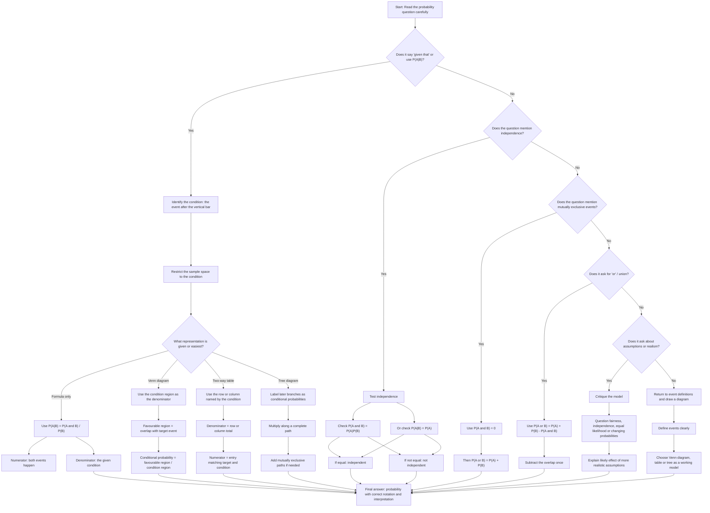

# A22ConditionalProbabilityMermaid-001

## Asset Metadata

| Field | Value |
|---|---|
| Asset ID | A22ConditionalProbabilityMermaid-001 |
| Unit | A22: A2 2 Applied Mathematics |
| Topic code | A22-PROB |
| Topic name | Conditional Probability |
| Topic ID | A22ConditionalProbability |
| Related lesson file | A22_conditional_probability_lesson.md |
| Related lesson section | Exam Technique Notes / Common CCEA-Style Wording / Visual and Interactive Asset Plan |
| Source | CCEA GCE Mathematics Specification Map, A22-PROB; Conditional Probability lesson PDF and transcript |
| Purpose | Provide a decision flow for choosing between conditional probability formula, Venn diagram, two-way table, tree diagram, independence test, mutually exclusive rule and modelling critique. |
| Linked LO IDs | A22-PROB-LO001, A22-PROB-LO002, A22-PROB-LO003 |
| Phase | Phase 2: Mermaid Diagrams |
| Status | Complete |

## Mermaid Code

