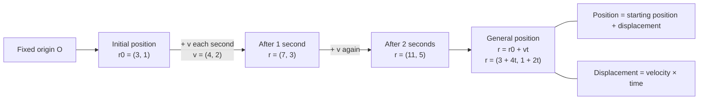

# A22FurtherKinematicsMMD-001

## Asset Metadata

| Field | Value |
|---|---|
| Asset ID | A22FurtherKinematicsMMD-001 |
| Asset type | Mermaid diagram |
| Unit | A22: A2 2 Applied Mathematics |
| Topic | Further Kinematics |
| Topic code | A22-KIN |
| Related LO IDs | A22-KIN-LO002 |
| Related lesson section | Core Theory: Constant velocity vector motion |
| Source | Chapter 8 Further Kinematics transcript; MechYr2-Chp8-FurtherKinematics.pdf p.3 |
| Purpose | Show how a starting position vector and constant velocity vector combine to form r = r0 + vt. |

