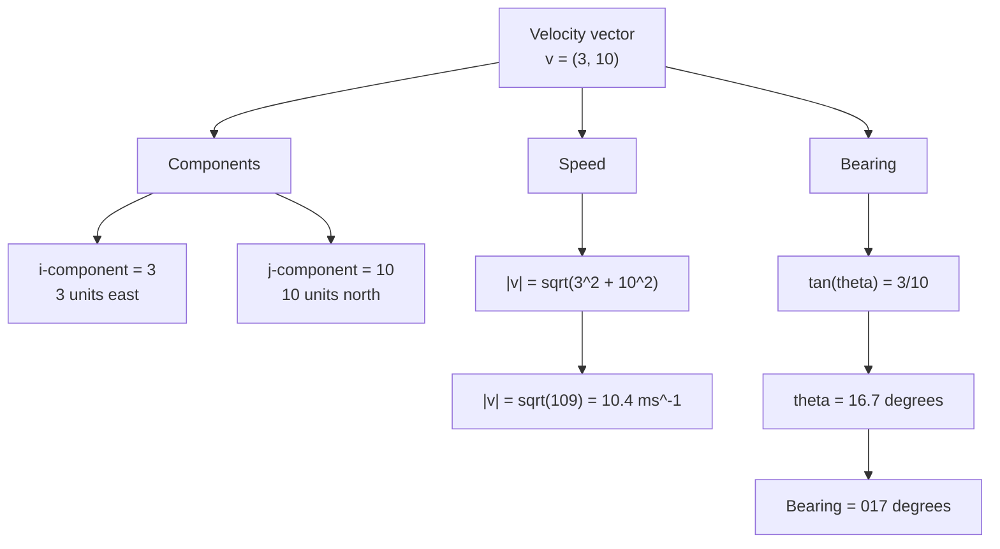

# A22FurtherKinematicsMMD-003

## Asset Metadata

| Field | Value |
|---|---|
| Asset ID | A22FurtherKinematicsMMD-003 |
| Asset type | Mermaid diagram |
| Unit | A22: A2 2 Applied Mathematics |
| Topic | Further Kinematics |
| Topic code | A22-KIN |
| Related LO IDs | A22-KIN-LO002 |
| Related lesson section | Worked Example: Velocity vector, speed and bearing |
| Source | Chapter 8 Further Kinematics transcript; MechYr2-Chp8-FurtherKinematics.pdf p.5 |
| Purpose | Show how a velocity vector gives speed by magnitude and direction by bearing. |

