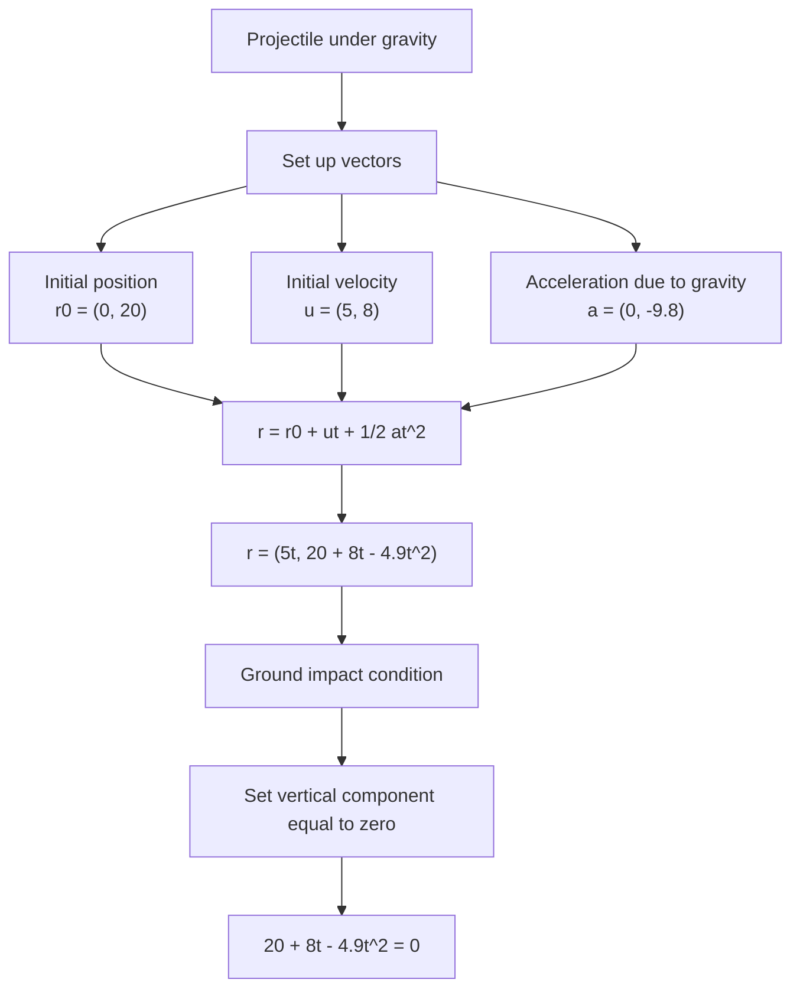

# A22FurtherKinematicsMMD-004

## Asset Metadata

| Field | Value |
|---|---|
| Asset ID | A22FurtherKinematicsMMD-004 |
| Asset type | Mermaid diagram |
| Unit | A22: A2 2 Applied Mathematics |
| Topic | Further Kinematics |
| Topic code | A22-KIN |
| Related LO IDs | A22-KIN-LO003, A22-KIN-LO004 |
| Related lesson section | Core Theory: Projectiles using vectors |
| Source | Chapter 8 Further Kinematics transcript; MechYr2-Chp8-FurtherKinematics.pdf p.9 |
| Purpose | Show the modelling flow for projectile motion using vector SUVAT under gravity. |

