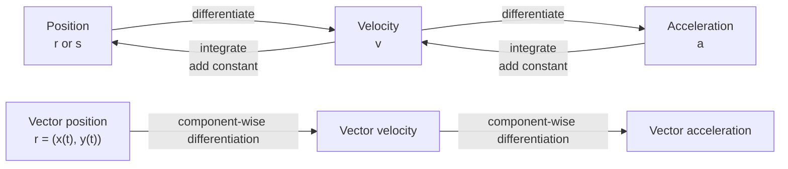

# A22FurtherKinematicsMMD-005

## Asset Metadata

| Field | Value |
|---|---|
| Asset ID | A22FurtherKinematicsMMD-005 |
| Asset type | Mermaid diagram |
| Unit | A22: A2 2 Applied Mathematics |
| Topic | Further Kinematics |
| Topic code | A22-KIN |
| Related LO IDs | A22-KIN-LO001, A22-KIN-LO002 |
| Related lesson section | Core Theory: Differentiating and integrating vectors |
| Source | CCEA specification map; Chapter 8 Further Kinematics transcript |
| Purpose | Show the calculus chain between position, velocity and acceleration. |

