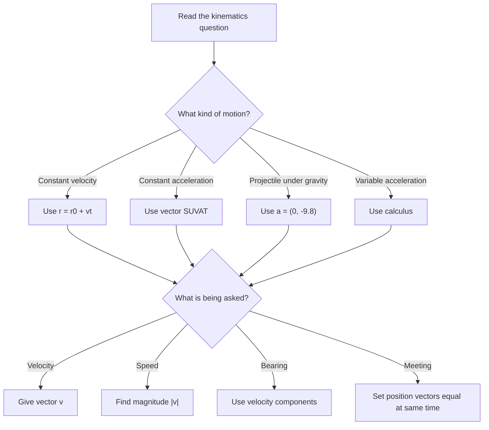

# A22FurtherKinematicsMMD-006

## Asset Metadata

| Field | Value |
|---|---|
| Asset ID | A22FurtherKinematicsMMD-006 |
| Asset type | Mermaid diagram |
| Unit | A22: A2 2 Applied Mathematics |
| Topic | Further Kinematics |
| Topic code | A22-KIN |
| Related LO IDs | A22-KIN-LO001, A22-KIN-LO002, A22-KIN-LO003, A22-KIN-LO004 |
| Related lesson section | Exam Technique: Classifying kinematics problems |
| Source | Chapter 8 Further Kinematics transcript; CCEA specification map |
| Purpose | Decision-flow for choosing between constant velocity, vector SUVAT, projectiles and calculus. |

