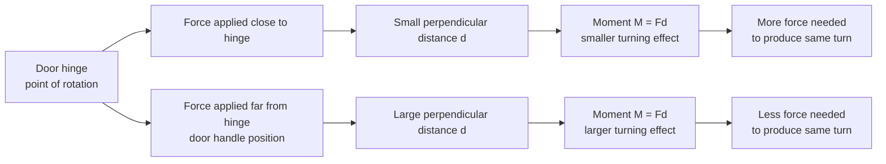

# A22MomentsMermaid-001

## Asset ID

`A22MomentsMermaid-001`

## Source

MechYr2 Chapter 4 Moments, page 2; Rigid Bodies transcript section 1.

## Related lesson section

Big Picture Explanation; Core Theory 1.

## Purpose

Door-handle moment intuition.

