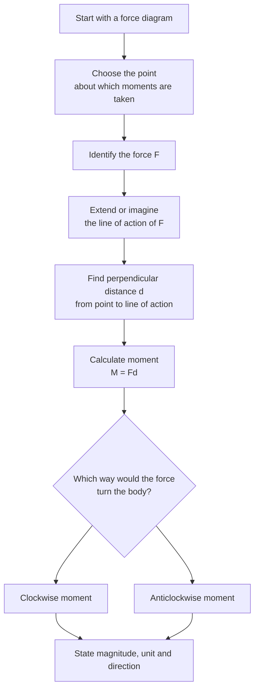

# A22MomentsMermaid-002

## Asset ID

`A22MomentsMermaid-002`

## Source

MechYr2 Chapter 4 Moments, pages 4 to 6; Rigid Bodies transcript section 1.

## Related lesson section

Key Definitions and Notation; Core Theory 1.

## Purpose

Moment method flow.

