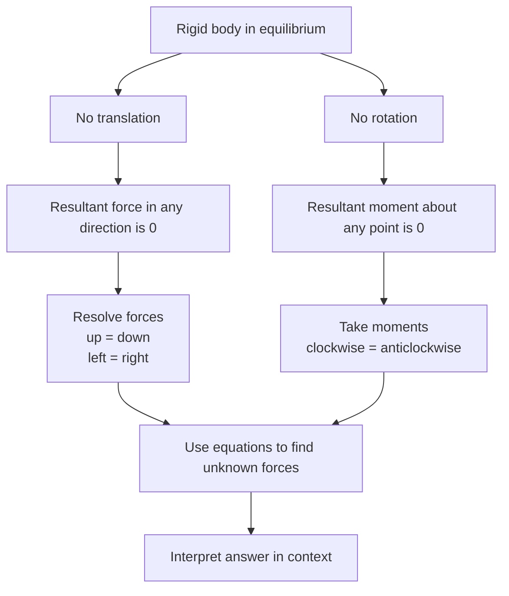

# A22MomentsMermaid-003

## Asset ID

`A22MomentsMermaid-003`

## Source

MechYr2 Chapter 4 Moments, page 12; Rigid Bodies transcript section 2.

## Related lesson section

Core Theory 2; Core Theory 3.

## Purpose

Rigid-body equilibrium summary.

