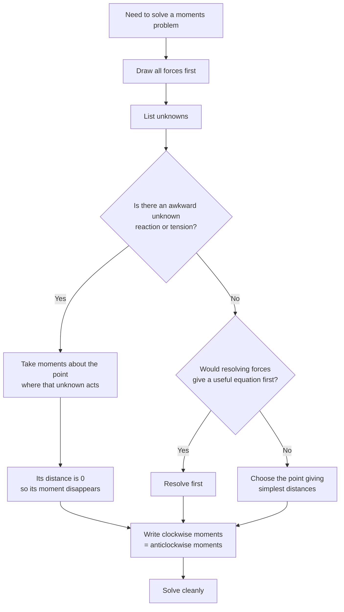

# A22MomentsMermaid-004

## Asset ID

`A22MomentsMermaid-004`

## Source

Rigid Bodies transcript sections 2 and 3.

## Related lesson section

Core Theory 4; Exam Technique Notes.

## Purpose

Choosing where to take moments.

