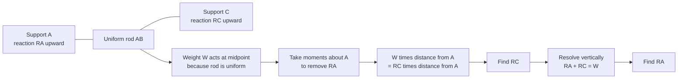

# A22MomentsMermaid-005

## Asset ID

`A22MomentsMermaid-005`

## Source

MechYr2 Chapter 4 Moments, pages 12 to 14; Rigid Bodies transcript sections 2 and 3.

## Related lesson section

Worked Example 4; Worked Example 6.

## Purpose

Uniform rod on supports.

