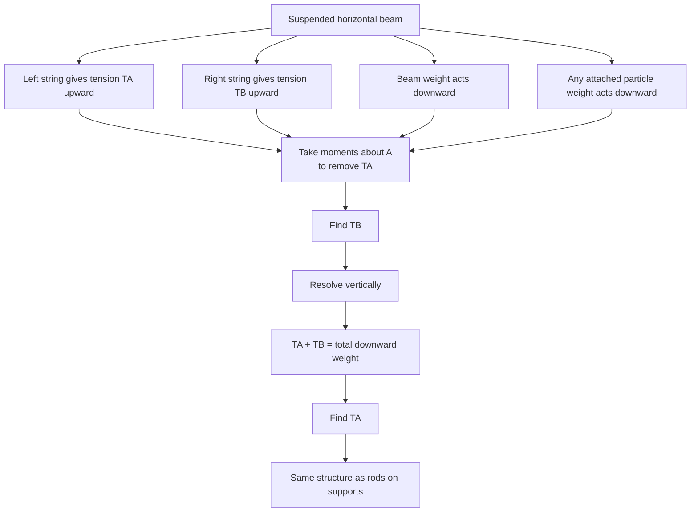

# A22MomentsMermaid-006

## Asset ID

`A22MomentsMermaid-006`

## Source

Rigid Bodies transcript section 4.

## Related lesson section

Worked Example 7; Worked Example 8.

## Purpose

Suspended beam with tensions.

