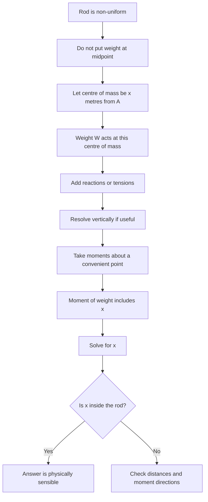

# A22MomentsMermaid-007

## Asset ID

`A22MomentsMermaid-007`

## Source

MechYr2 Chapter 4 Moments, page 17; Rigid Bodies transcript sections 6 and 7.

## Related lesson section

Worked Example 9; Key Definitions and Notation.

## Purpose

Non-uniform centre of mass.

